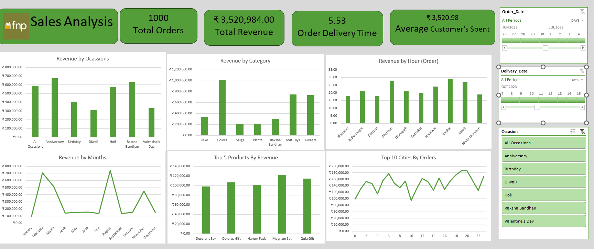

# 📊 Sales Performance & Customer Analysis Dashboard

## 📌 Project Overview

An interactive Sales Analysis Dashboard developed using Microsoft Excel to analyze sales performance, customer spending, product demand, seasonal trends and operational performance.

The project transforms raw transactional data into meaningful business insights through interactive dashboards, Pivot Tables, Pivot Charts and slicers.

## 🛠️ Tools & Skills

- Microsoft Excel
- Pivot Tables
- Pivot Charts
- Power query
- Power Pivot
- Slicers
- Data Analysis
- Dashboard Design
- Business Reporting

## 📊 Key Performance Indicators

| KPI | Value |
|---|---:|
| Total Orders | 1,000 |
| Total Revenue | ₹35,20,984 |
| Average Customer Spend | ₹3,520.98 |
| Average Order Delivery Time | 5.53 |

## 🔍 Analysis Performed

- Revenue by Occasion
- Revenue by Category
- Revenue by Month
- Revenue by Ordering Hour
- Top 5 Products by Revenue
- City-wise Order Activity
- Delivery Performance
- Customer Spending
- Interactive Order Date filtering
- Interactive Delivery Date filtering
- Interactive Occasion filtering

## 📈 Key Insights

- Colors was the largest revenue-generating category in the displayed analysis.
- Revenue showed noticeable peaks during February and August.
- Magnam Set generated the highest revenue among the displayed Top 5 products.
- Sales activity was relatively stronger during evening hours.
- Sales performance varied across occasions, categories, products, months and cities.

## 🖼️ Dashboard Preview

## 📁 Project Files

- [Excel Dashboard](FNP_Sales_Analysis_Dashboard.xlsx)
- [Project Documentation](FNP_Sales_Analysis_Documentation.docx)
- [Dashboard Preview](sales-dashboard.png)

## 🎯 Project Objective

The objective of this project was to transform raw transactional sales data into an interactive decision-support dashboard that can help analyze sales performance, customer behavior, product demand and operational trends.

### 👩‍💻 Author

**Shravani Sirsilla**

Aspiring Business / Data Analyst | Finance & Analytics

Skills: Excel | SQL | Power BI | Data Analysis
